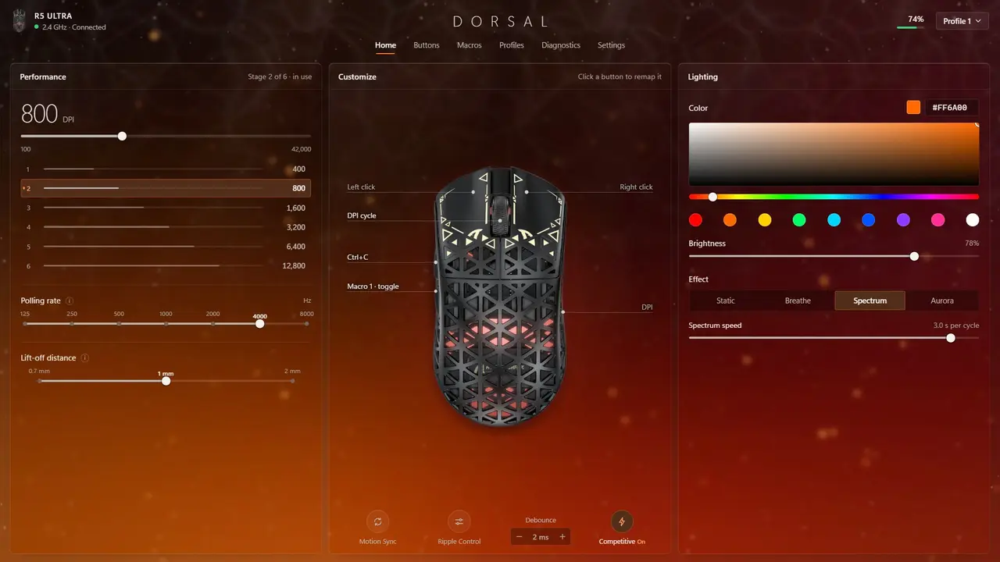
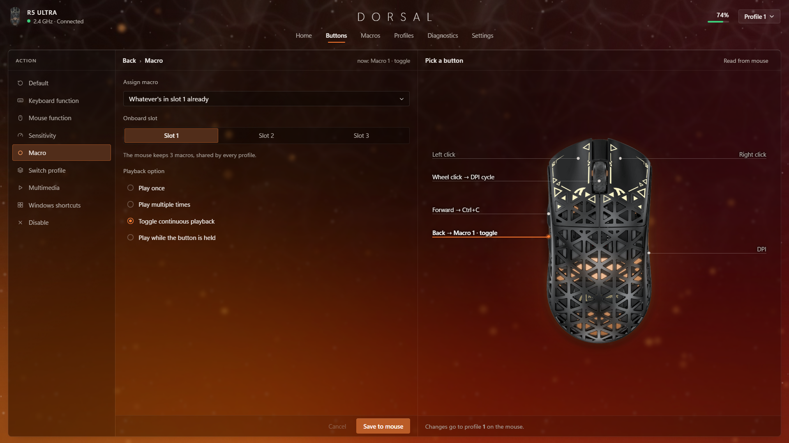
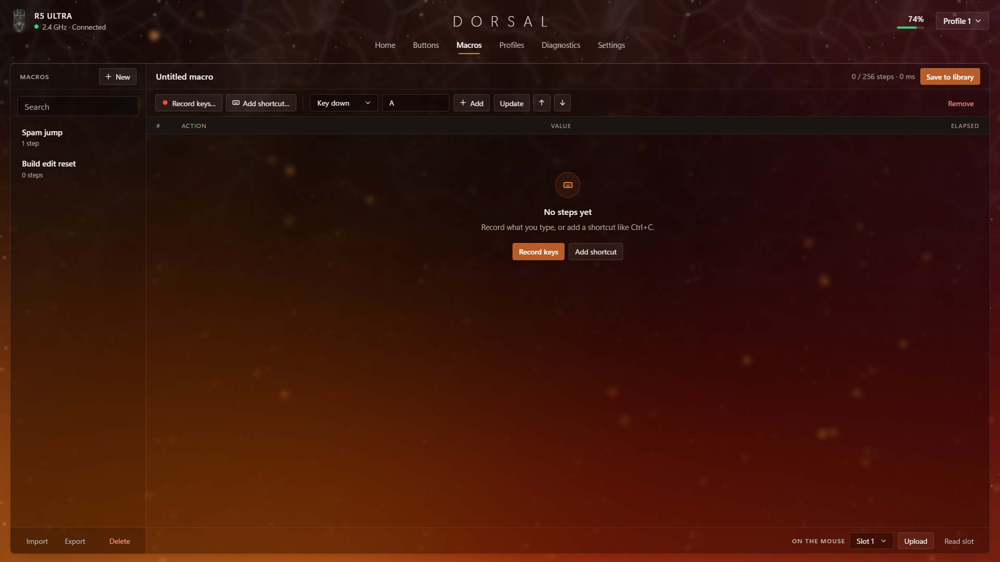
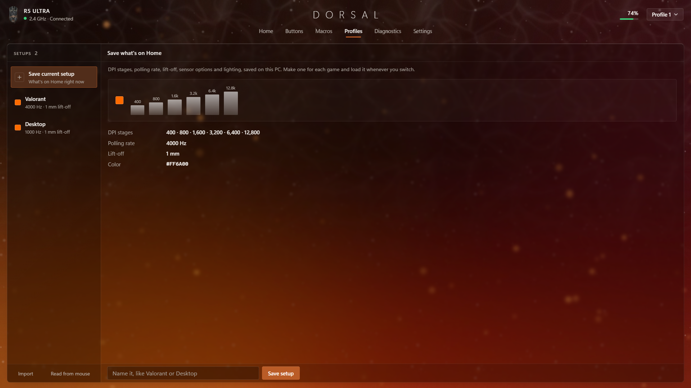
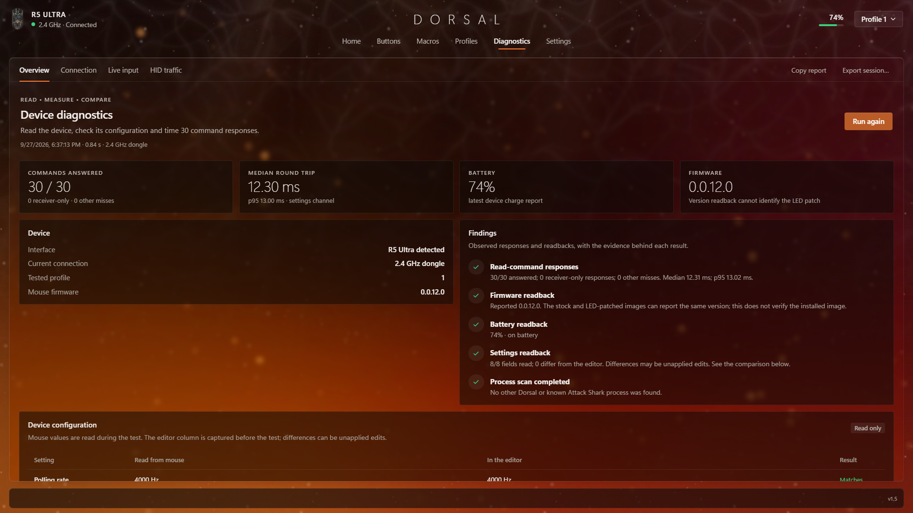
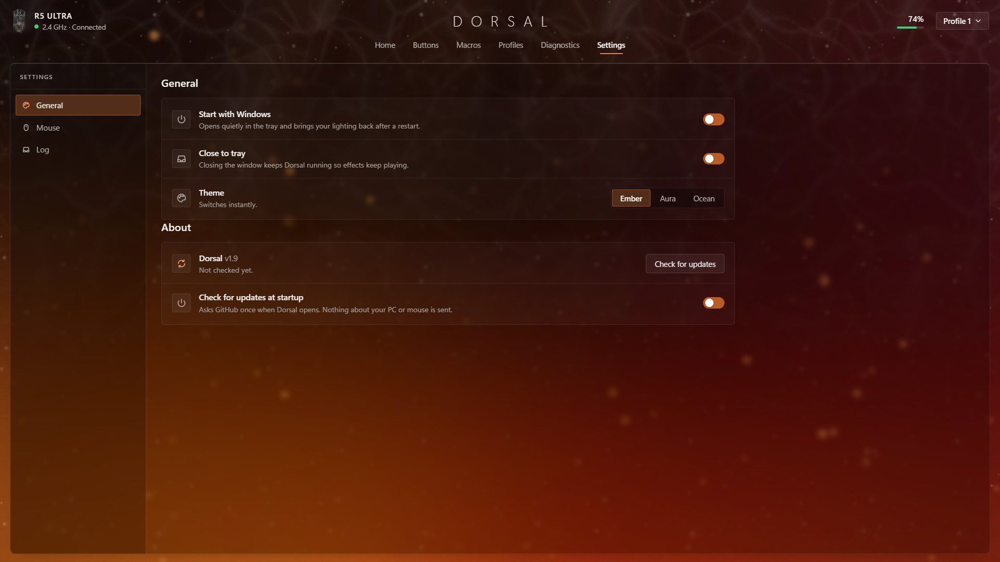
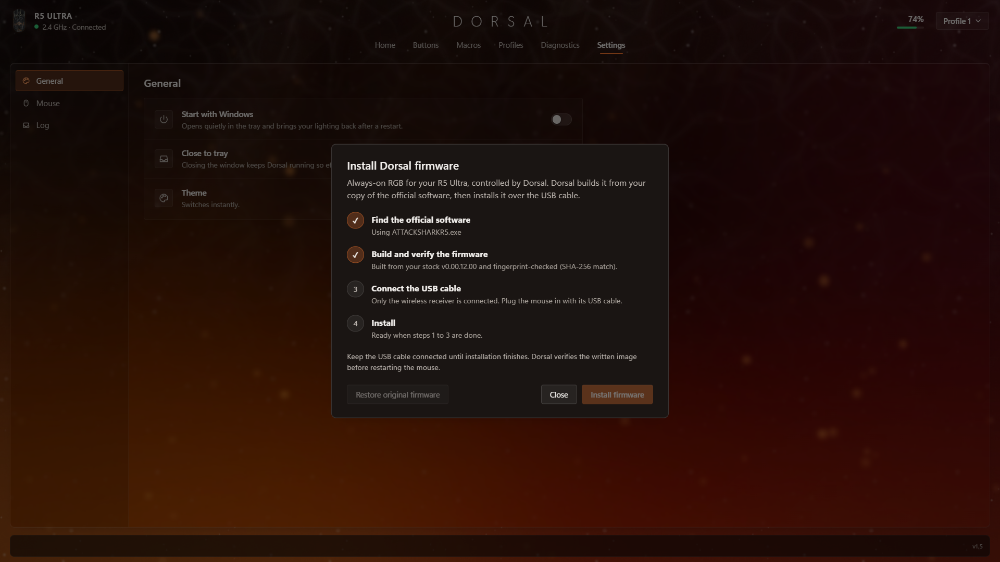

# Dorsal

A small control app for Attack Shark, LAMZU and other gaming mice, plus a one-byte firmware patch that makes the DPI LED stay on instead of going dark after a few seconds. It started as a tool for my R5 Ultra and it knows about 50 mice now.

[](https://github.com/Zelozzzz/dorsal/actions/workflows/tests.yml)
[](https://github.com/Zelozzzz/dorsal/releases/latest)



**[Download Dorsal for Windows](https://github.com/Zelozzzz/dorsal/releases/latest/download/Dorsal-Setup.exe)**

## why i made this

The R5 Ultra has an RGB LED in it, but stock firmware only flashes it for a few seconds when you change DPI and then turns it off. The official software just lets you pick the color of that flash. And the official app itself is a huge Electron thing that kept fighting my tray, got flagged by Defender, and randomly lost my settings when the dongle reconnected.

So I dug the USB protocol out of their app, found the one spot in the firmware that turns the LED off, patched it, and wrote my own app around it. Started as something for my own PC, putting it up in case anyone else has this mouse. Then it turned out a lot of other mice speak the same protocol, so they're in here too.

## what it does

- **RGB that stays on.** With the firmware patch the LED stays lit and Dorsal sends it colors. Static color, Breathe, Spectrum or Aurora. The mouse on screen lights up the same way the real one does: open shells glow through their holes, solid ones light their LED dot.
- **Firmware installer built in.** Builds the patch from your own copy of the official software (or the .hex from LAMZU's web hub), checks it before and after, and can put the original back whenever.
- **All the normal settings.** DPI stages (up to 6, the DPI button can go through fewer), polling up to 8000 Hz, lift-off, debounce, motion sync, ripple control, Competitive Mode, sleep time. Save to mouse reads the settings back before calling it verified.
- **Macros and button remapping.** Saved on the mouse itself, so they work even with Dorsal closed or on another PC.
- **Setups.** Save setups per game, share them as .json, or start from a preset.
- **Diagnostics.** Health check, live HID traffic, a reliability test, battery drain / time left, and a live polling rate + speed + click test.
- **Small.** About 50 MB installed vs 281 MB for the official app. Sits in the tray, can start with Windows.

|  | Official app (v1.0.2) | Dorsal |
|---|---|---|
| Download | 89 MB | 28 MB |
| Installed | 281 MB | 50 MB |
| DPI / polling / sensor stuff | yes | yes |
| Buttons and macros | yes | yes, checked on the mouse |
| RGB lighting | no | yes |
| LED that stays on | no | yes (firmware patch) |

## which mice

| how sure | mice |
|---|---|
| tried on a real mouse | Attack Shark R5 Ultra |
| LED firmware built and checked on a virtual mouse that runs the real firmware; nobody has flashed a real one yet | Attack Shark M5 Ultra and R6, LAMZU Maya X, Tachi, Inca, Maya, Paro and Thorn |
| LED stays on with the mouse's own setting, no firmware needed; nobody here has tried one | Attack Shark F1 Air, X11 Ultra, the rest of the Mouse Hub family (V8, X8 Ultra, V5, R11 Ultra and so on), the older X11 (cable only) |
| settings from their official apps, no LED firmware, nobody has tried one | about 40 more from LAMZU, WLMOUSE, RAWM, UNIUS and CRDRAKO, and the IPI Float 88 |

Dorsal asks which mouse you have the first time it opens and notices when you plug in a different one. A mouse nobody has tried isn't written to until you say it's yours. Every mouse, what's known about it and where its LED is (when that's known) is in [docs/MICE.md](docs/MICE.md). If you try one that isn't an R5 Ultra, say how it went with the ["I tried my mouse" issue form](https://github.com/Zelozzzz/dorsal/issues/new/choose); that's how the others get marked as tried.

## install

1. [Download Dorsal-Setup.exe](https://github.com/Zelozzzz/dorsal/releases/latest/download/Dorsal-Setup.exe) and open it.
2. Windows will probably say **"Windows protected your PC"**. That's only because the app isn't signed (signing costs money every year). Click **More info**, then **Run anyway**.
3. Click **Install**, then **Finish**. It installs just for you, no admin needed, and Dorsal opens.
4. Plug in the dongle. If the official app for your mouse is open, close it (check the tray by the clock too), both can't talk to the mouse at once. Dorsal tells you if Attack Shark's is still running.

That's it. For the LED to stay on you also need the firmware patch, see [installing the firmware](#installing-the-firmware).

Don't want an installer? Grab the portable zip from [Releases](https://github.com/Zelozzzz/dorsal/releases/latest), unzip it anywhere and run `Dorsal.exe`.

Settings are saved in `%APPDATA%\Dorsal` and they're kept when you update. Uninstall from Windows Settings > Apps.

### trying a pre-release

Some versions go out as a pre-release first, so they can be tried before the update check offers them to everyone. The download button above stays on the last full release. To try one, open [Releases](https://github.com/Zelozzzz/dorsal/releases), take the newest one marked pre-release and get `Dorsal-Setup.exe` from its files. It installs over what you have and keeps your settings, and a copy that's on a pre-release gets told about the next one.

## screenshots

| | |
|---|---|
|  |  |
| Buttons | Macros |
|  |  |
| Profiles | Diagnostics |
|  | |
| Settings | |

## the LED thing

The mouse has one RGB LED and the hardware can drive it fine, the PWM and color registers are all there. Stock firmware just never leaves it on. The official "LED control" only changes the color of each DPI stage's flash.

The patch changes the one branch that turns the LED off after that flash. After that the LED stays on and takes whatever color the PC sends, and Dorsal runs a little render loop that streams frames to it. That's how you go from a short DPI flash to an actual light. The same spot exists in the M5 Ultra's, the R6's and six LAMZU mice's firmware, so they get the same one-byte change.

I kept the effects to a few that look good: Breathe fades your color in and out, Spectrum goes through every color (speed is adjustable), and Aurora drifts through greens and purples.

Full write-up, including 3 patch attempts that didn't work, is in [docs/FIRMWARE.md](docs/FIRMWARE.md).

## installing the firmware

Settings > Dorsal firmware > **Install**. It goes through 4 steps:

1. Finds the official software on your PC (installed copy, or the installer in Downloads / Desktop / another drive). You can also just point it at the file. A LAMZU has no app to find: you pick its firmware .hex from LAMZU's web hub ([docs/FIRMWARE.md](docs/FIRMWARE.md#lamzu) has the addresses).
2. Builds the patched firmware from it and checks it against a known SHA-256. If it doesn't recognize the file it won't use it.
3. Waits for the USB cable. The wireless dongle can't flash, so plug the cable in.
4. Installs. Takes about 30 seconds, asks once before starting.

After it's done, turn the mouse off and on and press the DPI button once to turn the light on. **Restore original firmware** in the same window puts the stock one back.

<p align="center"></p>

The mouse makers' firmware (Attack Shark's, LAMZU's) isn't in this repo (it's not mine to share), the patch gets built on your PC from your own file.

> [!WARNING]
> Flashing can brick the mouse. Attack Shark has no official recovery tool, and nobody has tried LAMZU's own updater as one. The flasher only accepts the exact stock or patched image and never touches the bootloader. Every mouse but the R5 is flashed with the exact bytes its maker's own tool sends, and every block is read back and compared before the mouse restarts (that hasn't been run on a real bootloader yet); the R5 is flashed the way it always was, which has worked on a real one. It's still at your own risk.

## macros and buttons

1. **Macros**: add steps, use **Record keys** or **Add shortcut**, fix up delays and order. **Save to library** keeps it on your PC.
2. Pick a slot and hit **Upload & verify**. The mouse has 3 slots shared by all profiles. If an upload fails, Dorsal puts the old macro back.
3. **Buttons**: pick a button, choose **Onboard macro** (or any other action), **Save to mouse**.

It's all stored on the mouse, so it works on any PC with or without Dorsal. Packet format is in [docs/PROTOCOL.md](docs/PROTOCOL.md#buttons-and-onboard-macros-dorsal-21).

## command line

`dorsal-cli.exe` comes with the app (from source it's `python src/dorsal_cli.py`).

```text
dorsal status                          connection, battery, link quality, firmware
dorsal read                            every setting stored on the mouse
dorsal color FF8800 --brightness 200   static color
dorsal effect aurora --seconds 60      run an effect (Ctrl+C to stop)
dorsal dpi 400 800 1600 3200 6400 12800
dorsal firmware wizard                 build the LED patch or restore stock, then flash
```

Put `--profile 2` before a command to use another profile.

## how it works

The mouse talks over 64-byte HID feature reports on a vendor interface. Attack Shark doesn't document any of it, I pulled it out of their Electron app. Every reply echoes the command it's answering plus a status byte, which is how Dorsal checks every write and measures the connection. All the commands (bootloader too) are in [docs/PROTOCOL.md](docs/PROTOCOL.md). Mice on other platforms (the Mouse Hub ones, the older X11, the Float 88) each have their own small module, written from their makers' own web drivers.

The firmware work was checked on a virtual mouse: an emulator in `tools/virtual_mouse` that boots the real mouse firmware, so the patch could be watched doing its thing before anyone flashed it.

<details>
<summary>code layout</summary>

```text
src/
  launch.pyw          starts the app (Dorsal.exe)
  dorsal_cli.py       command line (dorsal-cli.exe)
  dorsal/
    protocol.py       packets and reply parsing
    device.py         HID connection, acks, reading settings
    onboard.py        button assignments and macro slots
    macros.py         macro steps and how the mouse encodes them
    library.py        saved macros and profiles
    effects.py        the lighting effects
    runner.py         plays an effect in the background
    diagnostics.py    battery estimate, polling/speed meters, link test
    rawinput.py       raw mouse input for the live test
    firmware.py       reading and patching firmware images
    flasher.py        flashing over the bootloader
    fw_install.py     the installer: find software, build, detect the cable
    models.py         every mouse Dorsal knows: ids, limits, what each one has
    compx.py          Attack Shark's Mouse Hub mice (F1 Air, X11 Ultra, the rest by model number)
    xseries.py        Attack Shark's X series on vendor 1D57 (the older X11)
    ipi.py            the IPI Float 88
    wizard.py         console firmware wizard (src/flash_wizard.py)
    core.py           all the app logic, no window
    webui.py          the window (WebView2), tray, single instance
    web/              the UI itself (html/css/js)
    scenery.py        background + lit mouse images
    art.py            LED glow on the mouse photo, app icon
packaging/            build script, PyInstaller spec, installer
tests/                tests, none need the mouse plugged in
tools/                the virtual mouse, and checks against the makers' own code
docs/                 protocol, firmware and per-mouse notes
```

</details>

## building it yourself

Needs Python 3.10+ on Windows.

```bash
pip install -r requirements.txt
python src/launch.pyw
```

App + portable zip:

```bash
pip install -r requirements.txt pyinstaller
python packaging/build.py
```

The installer gets built from `dist\Dorsal` with [Inno Setup](https://jrsoftware.org/isinfo.php) (`iscc packaging\installer.iss`). Pushing a tag like `v1.12` makes GitHub Actions run the tests, build the installer and zip, and put them up as a release with checksums.

Tests: `pip install -r requirements-dev.txt`, then `python -m pyflakes src tests` and `python -m pytest`.

## limits

- Windows 10/11.
- Only the R5 Ultra has been tried on a real mouse. Everything else ran on the virtual mouse, or on pretend mice written from the makers' own code, which is good but not the same thing. [docs/MICE.md](docs/MICE.md) says exactly what was checked for each.
- Effects run on your PC, so Dorsal has to be running (tray is fine). Static colors, macros and buttons are saved on the mouse. On the mice that save every color change to their memory (the Mouse Hub ones, the Float 88) there are no animated effects.
- The mouse only reports battery % and charging. Time left and power draw are estimates from how fast the % drops.
- Connection quality comes from command replies, the mouse doesn't report signal strength. Command round trip isn't click latency.
- Macros max out at 256 steps and 60 seconds per delay.

## credits / license

- The mice are Attack Shark's, LAMZU's and other brands'. This isn't affiliated with any of them.
- Protocol pulled from their Electron app since none of it is documented.
- The older Attack Shark X11's notes come from two MIT projects, [HolyJoey/attack-shark-x11](https://github.com/HolyJoey/attack-shark-x11) and [HarukaYamamoto0/attack-shark-x11-driver](https://github.com/HarukaYamamoto0/attack-shark-x11-driver). No code was copied, but the 320 DPI packets in `tests/data/` are from the second one. The F1 Air and X11 Ultra bytes were checked against [kr0mka/AttackSharkF1Air](https://github.com/kr0mka/AttackSharkF1Air) and [MontyMcK/attack-shark-x11-ultra-linux](https://github.com/MontyMcK/attack-shark-x11-ultra-linux) (both MIT), which were tried on real mice.
- Everything else: [Zelozzzz](https://github.com/Zelozzzz)

Code is MIT. The mouse makers' firmware (Attack Shark's, LAMZU's) isn't included, Dorsal builds it from your own copy of their software or, for a LAMZU, from the file you take from its web hub. The mouse photo (`src/dorsal/assets/r5ultra_top.png`) is Attack Shark's, it's only in here to show the mouse, and it's not covered by the MIT license. The other mice's photos aren't in the repo: Dorsal downloads each one from its brand's official web hub (xvalleyinno.top for most, controlhub.top for the Mouse Hub mice, szslxd-tech.com for the X11, shan.ipigame.cn for the Float 88; the same picture their own app shows) and keeps it in `%APPDATA%\Dorsal\device`. Nothing gets sent, and you can turn it off in Settings > About.
